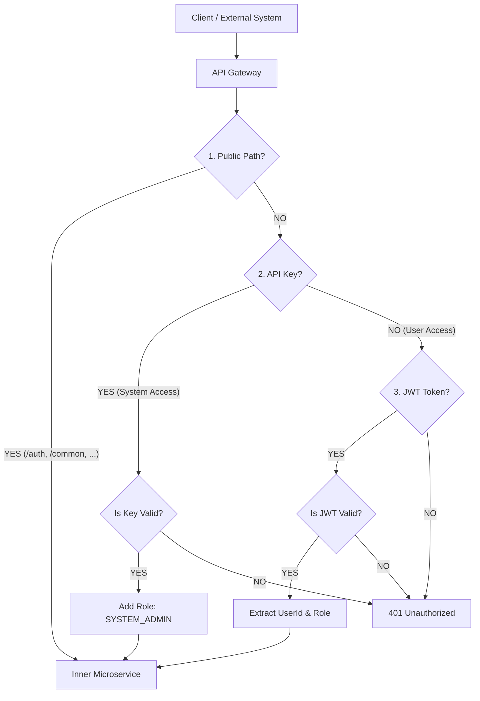

# VIMS 인증/인가 시스템 운영 가이드 및 흐름도

## 1. 개요
본 문서는 VIMS (Vehicle Inspection Management System)의 MSA 환경에서 Gateway를 통한 인증 및 인가 처리 흐름과 실제 운영 환경에서의 설정 방법을 기술합니다.

## 2. 인증/인가 흐름도 (Authentication & Authorization Flow)

Gateway는 모든 요청의 진입점 역할을 하며, **이중 인증 체계**를 통해 사용자(User)와 시스템(System) 간의 통신을 모두 지원합니다.



### 상세 단계
1.  **Public Access Check**: 로그인, 회원가입, 정적 리소스 등은 인증 없이 통과합니다.
2.  **API Key Authorization (System-to-System)**: `X-API-KEY` 헤더가 존재하면 시스템 간 통신으로 간주하고 키를 검증합니다. 성공 시 `SYSTEM_ADMIN` 권한을 부여하고 통과시킵니다.
3.  **JWT Authentication (User-to-System)**: API Key가 없으면 `Authorization` 헤더의 Bearer Token(JWT)을 검증합니다. 성공 시 토큰에서 사용자 ID와 Role을 추출하여 헤더에 싣고 통과시킵니다.

---

## 3. 운영 환경 설정 가이드 (Operations Guide)

개발 환경(Local)과 달리 **운영(Production) 환경**에서는 보안을 위해 반드시 다음 설정 값을 변경해야 합니다.

### 3.1. 필수 변경 설정 (application.yml / Environment)

`vims-gateway` 서비스의 `application.yml` 또는 환경 변수 설정을 통해 다음 값들을 **반드시 변경**하십시오.

| 설정 항목         | 설명   | 개발 환경 값 (Default) | **운영 환경 권장 값** |
| :---            | :--- | :---                 | :---                |
| `token.secret` | JWT 서명 및 검증에 사용되는 비밀키 | `key` | 32자 이상의 무작위 문자열 (예: `MySuperSecretKeyForProdEnv2024!@#`) |
| `gateway.api-key` | 시스템 간 통신에 사용되는 API Key | `vims-internal-secret-key-1234` | 예측 불가능한 UUID 또는 해시값 (예: `a1b2c3d4-e5f6-7890-abcd-ef1234567890`) |

### 3.2. 환경 변수 적용 방법 (Docker/Kubernetes 예시)

**Docker Compose 예시:**
```yaml
services:
  vims-gateway:
    image: vims-gateway:latest
    environment:
      - TOKEN_SECRET=MySuperSecretKeyForProdEnv2024!@#
      - GATEWAY_API_KEY=a1b2c3d4-e5f6-7890-abcd-ef1234567890
```

**운영 서버 실행 시:**
```bash
java -jar -Dtoken.secret="REAL_SECRET_KEY" -Dgateway.api-key="REAL_API_KEY" vims-gateway.jar
```

---

## 4. API 사용 가이드

### 4.1. 사용자(Front-end) 요청 시
로그인 후 발급산 `access_token`을 헤더에 포함하여 요청합니다.

```http
GET /api/v1/users/me
Authorization: Bearer <Users_JWT_Token>
```

### 4.2. 시스템(System/Batch) 요청 시
발급된 `API Key`를 헤더에 포함하여 요청합니다.

```http
GET /api/v1/batch/job
X-API-KEY: <Admin_Issued_API_Key>
```

## 5. 토큰 관리 정책 (Token Management Policy)
- **단일 기기 로그인 (Single Valid Token)**: 로그인 시 해당 사용자의 **기존 모든 토큰은 즉시 만료(Expired/Revoked)** 처리됩니다. 이를 통해 동시 로그인 제한 및 분실 토큰의 즉각적인 무효화 효과를 얻습니다.
- **로그아웃**: 로그아웃 시 현재 토큰만 만료 처리됩니다.

---
**문서 작성일**: 2026-01-08
**작성자**: 이경태
