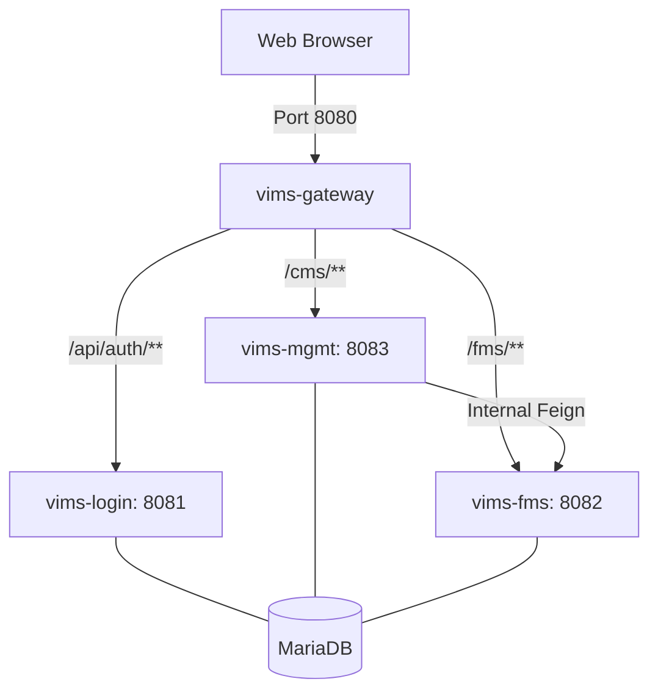

# VIMS (Vehicle Information Management System) 초기 구축 상세 가이드

본 문서는 VIMS 시스템을 새로운 환경에 구축하기 위한 **Step-by-Step 상세 기술 가이드**입니다. 각 모듈별 상세 설정 코드와 서비스 간 연동 메커니즘을 심층적으로 다룹니다.

---

## 1. 시스템 아키텍처 및 통신 맵

VIMS는 `API Gateway` 패턴과 `Core-lib` 공유 라이브러리 구조를 가집니다.



---

## 2. [필수] 데이터베이스 초기 선행 작업

MariaDB 10.3+ 환경에서 대용량 로그 처리를 위해 **파티션 테이블 변환**이 필수입니다.

### 2.1 로그 테이블 구조 변경 SQL
`TIMESTAMP`는 파티션 기준이 될 수 없으므로 `DATETIME`으로 변경하고, 날짜 컬럼을 PK에 포함시켜야 합니다.

```sql
-- [1] SYS_EVENT_LOG (감사로그) 변환
ALTER TABLE SYS_EVENT_LOG MODIFY COLUMN system_create_date DATETIME;
ALTER TABLE SYS_EVENT_LOG DROP PRIMARY KEY, ADD PRIMARY KEY (id, system_create_date);
ALTER TABLE SYS_EVENT_LOG PARTITION BY RANGE (TO_DAYS(system_create_date)) (
    PARTITION p202601 VALUES LESS THAN (TO_DAYS('2026-02-01'))
);

-- [2] SYS_ACCS_LOG (접속로그) 변환
ALTER TABLE SYS_ACCS_LOG MODIFY COLUMN system_login_date DATETIME;
ALTER TABLE SYS_ACCS_LOG DROP PRIMARY KEY, ADD PRIMARY KEY (id, system_login_date);
ALTER TABLE SYS_ACCS_LOG PARTITION BY RANGE (TO_DAYS(system_login_date)) (
    PARTITION p202601 VALUES LESS THAN (TO_DAYS('2026-02-01'))
);
```

---

## 3. 공통 라이브러리 (Core-lib) 배포

모든 서비스는 `core-lib`에 구현된 `Interceptor`, `Service`, `Mapper`를 공유합니다.

### 3.1 배포 스크립트 (`deploy-core-lib.sh`)
```bash
#!/bin/bash
# 1. core-lib 빌드
cd Core-lib/core-lib && mvn clean install
# 2. 각 모듈의 src/lib 폴더로 복사
cp target/core-lib-1.0.jar ../../vims-login/src/lib/
cp target/core-lib-1.0.jar ../../vims-management-system/src/lib/
cp target/core-lib-1.0.jar ../../FMS/src/lib/
```

---

## 4. 모듈별 상세 설정 (application.yml)

### 4.1 vims-gateway (8080) - 보안 및 라우팅
게이트웨이는 JWT 시크릿을 공유하며 요청을 중계합니다.

```yaml
spring:
  cloud:
    gateway:
      routes:
        - id: vims-login-route
          uri: http://localhost:8081
          predicates:
            - Path=/login/**, /api/v1/auth/**, /common/**
          filters:
            - AddRequestHeader=X-Source, Gateway # 내부 접근 검증용
token:
  secret: "YeyKgN7Oa0dfKJCR0Xr3Sp45WdU8BCv2Zd0X6KxRTfFgfPZ3MH3xccjC3WCt90Az"
gateway:
  api-key: "vims-internal-secret-key-1234"
```

### 4.2 vims-management-system (8083) - 파티션 자동화
파티션 자동 생성 스케줄러는 이 모듈에서만 활성화합니다.

```yaml
db:
  partition:
    maintenance:
      enabled: true # 가동 시 파티션 체크 및 자동 생성 실행
message:
  gateway:
    url: http://localhost:8080 # 게이트웨이를 통한 다국어 로드
fms:
  internal:
    api-key: "vims-internal-secret-key-1234" # FMS 호출 보안 키
```

---

## 5. 내부 통신 상세 구현 코드

### 5.1 Feign Client (Mgmt -> FMS 호출)
내부 API 키를 헤더에 담아 전송하는 상세 예시입니다.

```java
// Mgmt 모듈의 Feign 인터페이스 예시
@FeignClient(name = "fmsClient", url = "http://localhost:8082")
public interface FmsClient {
    @PostMapping("/fms/api/upload")
    void uploadFile(@RequestHeader("X-Internal-API-Key") String apiKey, @RequestBody FileDto file);
}
```

### 5.2 파티션 자동 생성 스케줄러 (DbPartitionService)
`core-lib`에 구현된 스케줄러 정체입니다.

```java
@Service
@ConditionalOnProperty(name = "db.partition.maintenance.enabled", havingValue = "true")
public class DbPartitionService {
    @Scheduled(cron = "0 0 3 * * *") // 매일 새벽 3시 실행
    public void maintainPartitions() {
        // 1. 현재 테이블 파티션 목록 조회 (INFORMATION_SCHEMA.PARTITIONS)
        // 2. 향후 2개월 파티션이 없으면 ALTER TABLE ADD PARTITION 실행
    }
}
```

---

## 6. 초기 구동 체크리스트

1.  **DB 컬럼 타입**: `SYS_EVENT_LOG.system_create_date`가 `DATETIME`인가? (TIMESTAMP면 파티션 생성 실패)
2.  **보안 키 일치**: `vims-gateway`의 `token.secret`과 각 서비스의 시크릿이 100% 일치하는가? (인증 오류 방지)
3.  **내부 API 키**: `vims-management-system`과 `FMS`의 `api-key` 설정이 동일한가?
4.  **로그 확인**: 기동 시 `DbPartitionService Initialized!` 로그가 찍히는가?

---

## 7. DB 매핑 및 엔티티 설정 주의사항 (JPA vs MyBatis)

VIMS 시스템은 **복잡한 쿼리는 MyBatis**, **단순 CRUD는 JPA**를 사용하는 하이브리드 구조입니다. 새로운 환경 구축 시 아래 매핑 규칙을 반드시 숙지해야 합니다.

### 7.1 @Table 어노테이션의 필요성
*   **JPA (findAll 등 Repository 내장 기능)**: 
    - JPA는 자바 클래스명을 기반으로 SQL을 자동 생성합니다. (예: `SysMenu` -> `sys_menu`)
    - DB가 대소문자를 구분하거나 테이블명이 대문자인 경우, `@Table(name = "SYS_MENU")` 처럼 명시해줘야 합니다. 명시하지 않으면 `Table doesn't exist` 에러가 발생합니다.
*   **MyBatis (find, register 등 Mapper 기능)**:
    - MyBatis는 XML 파일 안에 개발자가 직접 SQL을 작성합니다. (예: `SELECT * FROM SYS_MENU`)
    - SQL 내에 직접 대문자로 테이블명을 기술했으므로, 자바 엔티티 클래스에 `@Table` 설정이 없어도 정상 작동합니다.

### 7.2 운영 팁
*   외부 프로그램(Postman 등)을 통해 API를 테스트할 때 `500 Internal Server Error`와 함께 `Table not found` 에러가 난다면, 해당 서비스가 JPA 기능을 사용 중인지 확인하고 `@Table` 설정을 추가하십시오.

---


## 8. 내부 통신용 API-Key 체계 (Internal Security)

VIMS 시스템은 마이크로서비스 간의 통신 시 보안을 강화하기 위해 **`Internal API Key`** 검증 체계를 가집니다.

### 8.1 API-Key의 목적
*   **직접 접근 차단**: 게이트웨이(8080)를 거치지 않고 각 서비스(8081, 8082, 8083)의 포트로 직접 접근하여 내부 데이터를 조작하는 행위를 방어합니다.
*   **서비스 간 신뢰**: 신뢰할 수 있는 내부 모듈(예: Management 서버)이 다른 모듈(예: FMS 서버)의 기능을 호출할 때, 정당한 권한이 있음을 증명합니다.

### 8.2 작동 원리
1.  **호출자 (Caller)**: `vims-management-system` 등에서 타 서비스를 호출할 때, HTTP 헤더에 `X-Internal-API-Key` 라는 이름으로 설정된 키 값을 실어 보냅니다.
2.  **수신자 (Callee)**: `FMS` 등 API를 제공하는 쪽은 인터셉터나 필터에서 이 헤더 값을 감지합니다.
3.  **검증**: 헤더에 담긴 키 값이 자신의 `application.yml`에 설정된 `api-key`와 일치하는지 확인합니다. 일치하지 않으면 `403 Forbidden` 에러를 반환합니다.

### 8.3 설정 코드 샘플
*   **설정파일 (`application.yml`)**:
    ```yaml
    # 모든 서비스가 동일한 키 값을 가져야 합니다.
    fms:
      internal:
        api-key: "vims-internal-secret-key-1234" # 운영 시 복잡한 문자열로 변경 필수
    ```
*   **전송 코드 (Feign Client)**:
    ```java
    @PostMapping("/api/v1/internal/data")
    void callInternal(@RequestHeader("X-Internal-API-Key") String apiKey, @RequestBody Object data);
    ```

---

## 9. 관련 가이드 문서
추가적인 상세 내용은 `.agent/` 디렉토리 내 아래 문서를 참조하십시오.
*   `파티셔닝 가이드.md`: DB 파티셔닝 상세 원리 및 관리 방법
*   `audit-log-guide.md`: 감사 로그(Event Log) 기록 메커니즘
*   `API_GATEWAY_INTEGRATION_GUIDE.md`: 게이트웨이 및 서비스 간 연동 설정

---

본 가이드를 바탕으로 신규 환경 구축 시 **데이터베이스 선행 작업 -> core-lib 배포 -> 게이트웨이 기동 -> 서비스 기동** 순으로 진행하십시오.


