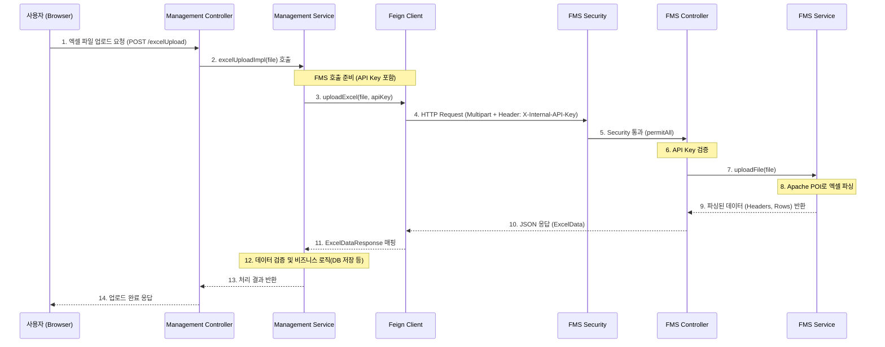

# 엑셀 업로드 로직 흐름 상세 가이드

이 문서는 VIMS 시스템에서 엑셀 파일을 업로드하고 처리하는 전체적인 로직 흐름을 설명합니다.  
현재 구조는 **Management Service**가 **FMS(File Management System)**를 **Feign Client**를 통해 호출하여 엑셀 파싱을 수행하는 마이크로서비스 아키텍처를 따르고 있습니다.

---

## 1. 전체 아키텍처 및 흐름도



---

## 2. ⚙️ 환경 설정 (Configuration)

이 기능을 구현하기 위해 필요한 `pom.xml` 의존성과 `application.yml` 설정을 설명합니다.

### 2.1. Maven 의존성 (`pom.xml`)

#### Management Service (`vims-management-system/pom.xml`)
다른 서비스(FMS)를 호출하기 위해 **OpenFeign**이 필요합니다.

```xml
<dependencies>
    <!-- Spring Cloud OpenFeign: 마이크로서비스 간 통신을 위한 선언적 HTTP 클라이언트 -->
    <dependency>
        <groupId>org.springframework.cloud</groupId>
        <artifactId>spring-cloud-starter-openfeign</artifactId>
    </dependency>
    
    <!-- Feign Core & SLF4J: Feign의 기본 기능 및 로깅 지원 -->
    <dependency>
        <groupId>io.github.openfeign</groupId>
        <artifactId>feign-core</artifactId>
        <version>13.1</version>
    </dependency>
    <dependency>
        <groupId>io.github.openfeign</groupId>
        <artifactId>feign-slf4j</artifactId>
        <version>13.1</version>
    </dependency>
</dependencies>

<dependencyManagement>
    <!-- Spring Cloud 버전 관리 (2023.0.0 버전 예시) -->
    <dependencies>
        <dependency>
            <groupId>org.springframework.cloud</groupId>
            <artifactId>spring-cloud-dependencies</artifactId>
            <version>${spring-cloud.version}</version>
            <type>pom</type>
            <scope>import</scope>
        </dependency>
    </dependencies>
</dependencyManagement>
```

#### FMS Service (`FMS/pom.xml`)
엑셀 파일을 읽고 쓰기 위해 **Apache POI** 라이브러리가 필요합니다.

```xml
<dependencies>
    <!-- Apache POI: 엑셀 파일 (.xls, .xlsx) 파싱 라이브러리 -->
    <dependency>
        <groupId>org.apache.poi</groupId>
        <artifactId>poi</artifactId>
        <version>5.2.3</version> <!-- 최신 안정 버전 사용 권장 -->
    </dependency>
    <dependency>
        <groupId>org.apache.poi</groupId>
        <artifactId>poi-ooxml</artifactId>
        <version>5.2.3</version>
    </dependency>
</dependencies>
```

---

### 2.2. 애플리케이션 설정 (`application.yml`)

보안(API Key)과 서비스 URL을 설정합니다. **양쪽 서비스의 API Key가 반드시 일치해야 합니다.**

#### Management Service (`vims-management-system/src/main/resources/application.prod.yml`)

```yaml
spring:
  cloud:
    openfeign:
      client:
        config:
          default:
            connectTimeout: 5000 # 연결 타임아웃 (ms)
            readTimeout: 60000   # 파일 업로드 시간 고려 (60초)

# FMS 서비스 연동 설정
fms:
  service:
    url: http://localhost:8082 # FMS 서비스 주소
  internal:
    api-key: "your-secure-internal-api-key-here" # FMS와 공유하는 비밀키
```

#### FMS Service (`FMS/src/main/resources/application.prod.yml`)

```yaml
# 내부 서비스 간 인증용 API 키 설정
fms:
  internal:
    api-key: "your-secure-internal-api-key-here" # Management와 반드시 동일해야 함!

server:
  port: 8082 # FMS 서비스 포트
```

---

## 3. 🚀 단계별 상세 설명 및 코드 예시

### Step 1: 프론트엔드 요청 (User → Management)
사용자가 웹 화면에서 엑셀 파일을 선택하고 업로드 버튼을 클릭합니다.
- **URL**: `/cms/common/{domain}/excelUpload`
- **Body**: `multipart/form-data` (Key: `file`)

### Step 2: Management Controller 수신 (AbstractCommonController)
`SysUserController` 등의 컨트롤러가 요청을 받습니다.

```java
// AbstractCommonController.java (부모 클래스)
@PostMapping("/excelUpload")
@ResponseBody
public int excelUpload(@RequestParam(value = "file", required = false) MultipartFile file) throws Exception {
    // 하위 클래스(Service)의 구현체 호출
    return abstractCommonService.excelUploadImpl(file);
}
```

### Step 3: Management Service & Feign Client 호출
Service 계층에서 FMS로 파일을 보내기 위해 Feign Client를 사용합니다.

```java
// SysUserService.java
@Value("${fms.internal.api-key}")
private String fmsInternalApiKey; // application.yml에서 주입

@Override
protected int excelUploadImpl(MultipartFile file) throws Exception {
    // ... 생략 ...
    // FMS 서비스의 엑셀 업로드 API 호출 (API Key 전달)
    ExcelDataResponse excelData = fmsExcelClient.uploadExcel(file, fmsInternalApiKey);
    // ... 생략 ...
}
```

```java
// FmsExcelClient.java (Feign Interface)
@FeignClient(name = "fms-service", url = "${fms.service.url:http://localhost:8082}", configuration = FmsClientConfiguration.class)
public interface FmsExcelClient {
    // API Call 정의
    @PostMapping(value = "/fms/excel/excelUpload/upload", consumes = MediaType.MULTIPART_FORM_DATA_VALUE)
    ExcelDataResponse uploadExcel(
            @RequestPart("file") MultipartFile file,
            @RequestHeader("X-Internal-API-Key") String apiKey); // 헤더로 Key 전송
}
```

### Step 4: FMS 수신 및 보안 검사 (Management → FMS)
FMS 서비스가 요청을 받습니다. Spring Security 설정에 의해 해당 경로는 인증 없이 통과됩니다.

```java
// SecurityConfig.java (FMS)
@Bean
public SecurityFilterChain filterChain(HttpSecurity http) throws Exception {
    http
        .csrf(AbstractHttpConfigurer::disable) // CSRF 해제 (API 서버 역할)
        .authorizeHttpRequests(auth -> auth
            // 이 경로는 Security 필터가 잡지 않고 통과시킴
            .requestMatchers(new AntPathRequestMatcher("/fms/excel/**")).permitAll()
            .anyRequest().permitAll()
        );
    return http.build();
}
```

### Step 5: FMS Controller 및 API Key 검증
보안 필터를 통과한 후, Controller 내부에서 **실제 Key 값 비교**를 수행합니다.

```java
// ExcelUploadController.java (FMS)
@Value("${fms.internal.api-key}")
private String expectedApiKey; // FMS가 알고 있는 정답 Key

@PostMapping("/upload")
public ExcelData uploadFile(
    @RequestParam("file") MultipartFile file,
    @RequestHeader(value = "X-Internal-API-Key", required = false) String apiKey
) {
    // 여기서 직접 Key 비교 (다르면 403 에러)
    if (apiKey == null || !expectedApiKey.equals(apiKey)) {
        throw new ResponseStatusException(HttpStatus.FORBIDDEN, "FMS 서비스 접근 권한이 없습니다.");
    }
    
    return excelUploadService.uploadFile(file);
}
```

### Step 6: 엑셀 파싱 (FMS Service)
Apache POI를 사용하여 엑셀 파일을 읽고 데이터를 추출합니다.

```java
// ExcelUploadService.java (FMS)
public ExcelData uploadFile(MultipartFile file) {
    ExcelData excelData = new ExcelData();
    // ... Workbook 생성 ...
    
    // 1. 헤더 추출
    Row headerRow = sheet.getRow(0);
    for (Cell cell : headerRow) {
        excelData.getHeaders().add(getCellValue(cell).toString());
    }

    // 2. 데이터 행 추출
    for (int i = 1; i <= sheet.getLastRowNum(); i++) {
        Row row = sheet.getRow(i);
        Map<String, Object> map = new HashMap<>();
        // ... 셀 값 읽어서 map에 put ...
        excelData.getDataRows().add(map);
    }
    
    return excelData;
}
```

### Step 7: 응답 매핑 (ExcelDataResponse)
JSON으로 반환된 데이터를 Management의 DTO로 받습니다.

```java
// ExcelDataResponse.java (Management DTO)
@Getter
@Setter
public class ExcelDataResponse {
    private String fileName;
    private List<String> headers;
    private List<Map<String, Object>> dataRows; // FMS의 dataRows와 매핑
    private int totalRows;
}
```

### Step 8: Management 후처리 및 결과 반환
Management Service가 응답을 받아 비즈니스 로직을 수행합니다.

```java
// SysUserService.java
try {
    ExcelDataResponse excelData = fmsExcelClient.uploadExcel(file, fmsInternalApiKey);

    // 데이터 검증
    if (excelData == null || excelData.getDataRows() == null || excelData.getDataRows().isEmpty()) {
        throw new CustomException(getMessage("EXCEPTION.FMS.NO_DATA"));
    }

    // TODO: 여기서 DB 저장 로직 수행
    // for (Map<String, Object> row : excelData.getDataRows()) { ... }

    return 0; // 성공 시 0 반환 (또는 처리 건수)

} catch (SecurityException e) {
    // 403 에러 처리
    throw new CustomException(getMessage("EXCEPTION.FMS.ACCESS_DENIED"));
} catch (Exception e) {
    // 기타 에러
    throw new CustomException(getMessage("EXCEPTION.FMS.UPLOAD_ERROR"));
}
```

---

## 4. 🔐 보안 핵심 (API Key 방식)

- **설정**: 양쪽 `application.yml`에 `fms.internal.api-key: "비밀키"` 설정
- **전송**: HTTP Header `X-Internal-API-Key` 사용
- **검증**: FMS Controller에서 `equals()` 비교

이 문서는 시스템의 엑셀 업로드 흐름을 이해하고 유지보수하는 데 사용됩니다.
